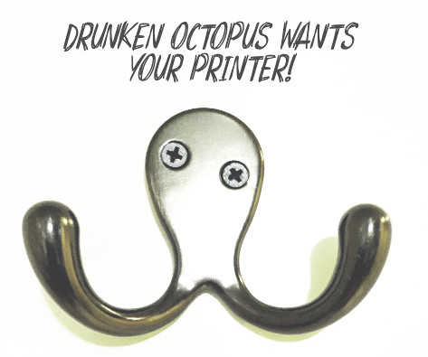

# Introduction

*Drunken Octopus* Marlin: An Alternative (Unofficial) Firmware for AlephObjects Printers

## Who can benefit from *Drunken Octopus* Marlin?

This firmware is for users who want the very latest firmware and features for their AlephObjects 
printers and **are willing to take the risks associated with running development firmware**. It is 
also for people who want to modify their AlephObjects printers into custom configurations.

Default firmware may not be current or may have certain features turned off for the comfort of new 
users. On the contrary, *Drunken Octopus* will charge right ahead, taking it all in, because that 
is how he likes to roll!

## *Drunken Octopus* comes in up to 196 different flavors!

If you are savvy with electrical and mechanical things, *Drunken Octopus* will give you the 
software to match any hardware upgrades you make to your printer. Head over to the the
[Drunken Octopus Firmware Tool] and [Drunken Octopus Wiring Guide] to see all the
possibilities!

## Got questions?

See the [FAQ] for answers to the following questions:

- Will *Drunken Octopus* binaries and pre-build configuration files be provided?
- Will using *Drunken Octopus* void my printer warranty?
- Will *Drunken Octopus* damage my printer?
- What if I want my printer to remain sober?

# Need more assistance?

*Drunken Octopus* is supported by a community of users. Head over to the [Forums] to get help.

# How can you help make *Drunken Octopus* a success?

See the [contributing] page for a list of ways to chip in!

# License

Marlin is published under the [GPL license] because we believe in open development. 
The GPL comes with both rights and obligations. Whether you use Marlin firmware as the driver 
for your open or closed-source product, you must keep Marlin open, and you must provide your 
compatible Marlin source code to end users upon request. The most straightforward way to comply 
with the Marlin license is to make a fork of Marlin on Github, perform your modifications, and 
direct users to your modified fork.

While we can't prevent the use of this code in products (3D printers, CNC, etc.) that are closed 
source or crippled by a patent, we would prefer that you choose another firmware or, better yet, 
make your own.

**Photo Credits:** Coat hanger photograph by Ari Sytner. Used with permission.

[FAQ]: faq.md
[contributing]: contributing.md
[GPL license]: /LICENSE
[Forums]: https://forums.drunkenoctop.us/
[GitHub Issues]: https://github.com/drunken-octopus/drunken-octopus-marlin/issues
[Drunken Octopus Firmware Tool]: http://www.drunkenoctop.us/drunken-octopus-downloader/
[Drunken Octopus Wiring Guide]: https://www.drunkenoctop.us/drunken-octopus-marlin/pinouts/
